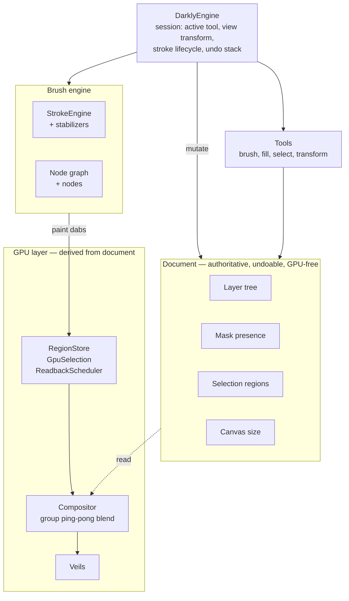

# Darkly — Agent Guidelines

Darkly is a web-based, gpu-native paint program written in Rust, Svelte and Typescript, leveraging WebAssembly and WebGPU.

## Architecture

Darkly's Rust core (`crates/darkly/`) is platform-agnostic. It contains the document model, GPU compositor, veils, brush engine, undo system, and the `DarklyEngine` — all with zero platform dependencies. A WASM bridge wraps the engine for the browser.

State is split three ways: the **document** is authoritative and undoable (layer tree, masks, selection, canvas size); **session** state lives on `DarklyEngine` (active tool, view transform, in-flight stroke); the **compositor** is a derived realization (GPU textures, blend pipelines, render caches) that's always rebuildable from the document. Data flows downhill — document → compositor, session → compositor — never the other way.

**Runtime stack** — how a pointer event becomes a pixel:


**Inside the Rust core** — the document is authoritative; the compositor is a derived realization. Data flows downhill, never up:



**Modular subsystems** — `build.rs` scans these directories and auto-generates the registration code, so adding a veil / tool / brush node / stabilizer / config section is a single new file with a `register()` function. No central match arms, no hand-maintained lists.

| Directory | What lives here |
| --- | --- |
| `gpu/veils/` | Veil effects (rainy glass, VHS, kuwahara, …) |
| `tools/` | Selection + transform tools |
| `brush/nodes/` | Brush graph nodes (pen_input, stamp, curve, …) |
| `brush/stabilizers/` | Stroke stabilizers |
| `config/sections/`, `config/presets/` | Config schema sections + bundled presets |

```
crates/darkly/          Platform-agnostic core (wgpu, pure Rust)
  src/document.rs       Authoritative document model
  src/engine/           DarklyEngine — session state + dispatch
  src/gpu/              Compositor, veils, shaders
  src/brush/            Node-graph brush engine, stroke engine, library
  src/nodegraph/        Generic node-graph (graph, compiler, layout)
  src/tools/            Selection / transform tools
  src/undo/             Undo stack + per-domain undoable ops
frontend/wasm/          WASM bridge (wasm-bindgen) → browser
frontend/src/           Svelte UI
shared/styles/          @darkly/styles — tokens + themes shared by UI and website
website/                Astro + Starlight site (splash, docs, /demo/)
```

## Modularity Principle

Module-specific code lives in the module. Module-generic infrastructure — registries, dispatchers, shared state, caches — is generic by name and by shape, never named after any single module that happens to use it today.

When adding a new item to a modular system (filter, tool, brush, etc.):

- **DO:** Create a single file in the appropriate directory that contains everything about that module — struct, implementation, registration function, constants, helpers.
- **DO NOT:** Add match arms to a central dispatcher. Add entries to a handwritten list. Touch any file outside the module directory except the generated `mod.rs`.

The project uses a `build.rs` script that scans module directories and auto-generates `mod.rs` files with module declarations and a `registrations()` function. This is the Rust equivalent of Python's `__init__.py` auto-discovery. Each module exports a `pub fn register()` that returns a registration struct describing everything the system needs to know about that module.

**Adding a new filter** = create `crates/darkly/src/gpu/filters/my_filter.rs` with a `register()` function. Done. No other file touched.

**Example — the filter system:**
- `filter.rs` defines `Filter` trait, `FilterRegistration` struct, `FilterRegistry` (HashMap-backed, lazy pipeline caching). *Filter* is the generic noun — there's no `NoiseFilterRegistry`, even though noise was probably the first filter implemented.
- `filters/noise.rs` exports `register() -> FilterRegistration` containing type ID, pipeline constructor, and JS factory
- `filters/mod.rs` is generated by `build.rs` — never edit it manually
- `FilterRegistry::new()` calls the generated `registrations()` to populate itself
- The compositor calls trait methods on `dyn Filter` — it never branches on filter type

**Type-owned dispatch:** This same pattern applies to all modular systems in the project, including types and interfaces, which should own their own dispatch logic. Any time a type has variant-specific behavior — a format-specific GPU pipeline, a color-space-specific blend, a tool-specific cursor — the dispatch lives in the type, behind a uniform interface. Consumers call the interface; they never branch on which variant they got. *Anti-pattern: `if mask { ... } else { ... }` sprinkled across code that consumes a paint surface; the format-specific dispatch is conceptually a paint-surface concern, so it belongs in the paint-surface interface, not at every call site.*

## DRY Principle

Don't Repeat Yourself — and interpret this broadly. If two pieces of code aren't identical but follow a similar enough pattern that they could be generalized, they should be. This applies across modules, layers (Rust, WASM bridge, JS), and systems.

**Place functionality where it generalizes.** Before writing logic, ask: "where does this belong so that it works for all cases, not just this one?" If a behavior applies to any tool, it belongs in the tool system's generic hooks — not inside one specific tool. If a behavior applies to any async operation, it belongs in the async completion pipeline — not special-cased at one call site. Putting the right logic in the right architectural layer eliminates the need to repeat it, and prevents future features from having to rediscover where to plug in. A good signal you've placed something wrong: it only works for one workflow, or a second caller would have to copy-paste the same pattern.

## Ownership Principle

State belongs to the thing it describes — not to a parent that manages it on its behalf. Don't let Rust's borrow checker dictate the data model. If splitting state out of a struct makes borrowing easier but scatters a logical concept across multiple locations, find a different way to satisfy the borrow checker (helper methods, borrow-splitting, restructured access) and keep the data model clean.

## Document Authority Principle

The **document** is the authoritative model. The **compositor** is a derived realization. State falls into three categories:

- **Document** (`crates/darkly/src/document.rs`, `src/layer.rs`): persistent, undoable, serializable. Tree structure, layer properties, mask presence, layer extents, selection regions, canvas size. Must be possible to reason about without a GPU.
- **Session** (fields on `DarklyEngine` and tool/UI structs): transient editor state. Active tool, mask-editing target, viewport transform. Does not survive reload.
- **Compositor** (`src/gpu/compositor.rs` and friends): GPU textures, bind groups, pipelines, render caches. Always derivable from document + dirty regions; rebuildable on demand.

**Data flows downhill: document → compositor, session → compositor.** The compositor never feeds back upward. If a piece of state seems to want to flow up, the model is broken — fix the originating operation to lead with the document.

**Bulk pixel data (layer pixels, mask pixels) is the principled exception** — GPU-authoritative because it's huge and the GPU is where it's used. The document tracks "this layer has pixels" structurally (e.g. `has_mask`); the bytes themselves live in VRAM.

**Anti-patterns to recognize and refuse:**

- A doc-side bool and a `HashMap<LayerId, _>` on the compositor that mirror the same fact (`has_mask` vs `mask_textures.contains_key(id)` was the canonical example).
- A doc-side field and a GPU resource's metadata that must be manually re-synced after a compositor-led operation.
- The same logical fact stored in two places "for ergonomics" — pick one home and expose a getter for the other side.

**When in doubt:** if the value survives save/load, it's document. If it can be rebuilt from the document on the next frame, it's compositor. Otherwise it's session.

## Prior Art Principle

Before deciding on an approach, research how established editors handle it. Krita and GIMP are checked out under the project root (`krita/`, `gimp/`). Read the actual source — never rely on web searches, docs, blog posts, or LLM training data for architectural claims. If a reference repo isn't checked out, clone it. Never claim "Krita does X" without pointing to a specific file and function. When delegating research to a subagent, instruct it to clone and cite specific files and line numbers — reject any claim not backed by source.

We do not blindly copy prior art; we use it to inform our own decisions. Our implementation will differ in specifics (GPU pipelines, tile formats, Rust idioms), but core algorithms and architectural decisions should be informed by prior art, not invented from scratch.

## Credit Principle

When an idea, algorithm, shader, or implementation comes from an external source — open source code, Shadertoy, papers, blog posts, video tutorials, etc. — credit the source and author at the top of the file (or inline next to the borrowed fragment, if it's smaller than file-scope). Include the author's name or handle and a link to the original.

## Performance Principle

Performance is king. If a feature can't be fast, it doesn't ship. There is almost always a fast way to do something — find it before writing the naive version. Think about data access patterns, per-frame costs, and batch granularity up front, not after the profiler screams.

Past lessons that illustrate the pattern:

- **Flood fill** was doing per-pixel HashMap lookups across a tiled image (~8M hash ops). Fix: batch at the tile level — one lookup per tile, direct array indexing within. Orders of magnitude faster.
- **Selection overlay** generated one GPU primitive per boundary pixel (~800 instances for a rectangle). Fix: merge collinear segments and simplify polylines once when the selection changes — down to ~4-30 primitives.
- **Animation scheduling** had independent per-system timers that forced extra frame renders. Fix: a single master clock with integer divisors so slower systems' ticks always align with faster ones — zero extra renders.

See `gpu-lessons-learned.md` for full details.

## Testing Principle

**Every feature must have a test.** Verify the feature works. The test exists; it passes. That's it.

**Every bug must have a _regression_ test — one that defends against that specific bug being reintroduced.** "Regression" means "the bug we just fixed must not come back"; a test for a new feature is not a regression test, even if it follows the same pattern. Write it FIRST, confirm it FAILS against the unfixed code, then fix the bug and confirm it passes; if it doesn't fail without the fix, it doesn't count.

## No Blocking GPU Readbacks

**Never use `device.poll(Wait)`, `blocking_read()`, `readback_texture()`, or any synchronous GPU→CPU readback in production code.** These deadlock on WebGPU/WASM — the browser event loop is the only mechanism for resolving GPU buffer mappings, and any form of blocking (`recv()`, spin-wait, `thread::park()`) prevents it from running. See `gpu-lessons-learned.md` §5 for the full stack trace of why.

The correct pattern is async readback: `request_readback()` → `readbacks.submit()` → poll on the next frame via `ReadbackScheduler`. If CPU data is needed from a GPU texture that changes infrequently (e.g., the selection mask), maintain a CPU cache populated by the async readback and read from that.

`test_utils::readback_texture()` and `blocking_read()` are **test-only** — they work on native (Vulkan/Metal) where `device.poll(Wait)` drives the completion queue synchronously. They must be gated behind `#[cfg(test)]` and never called from engine, compositor, or WASM bridge code.

## Engineering Principle

Every system must be implemented properly. No hacks, no hardcoding, no shortcuts in Rust or the WASM bridge. If we implement one of something, we build a proper system for it. It's okay to take a step back from the current task to do things right.

**Every bug is a signal that something nearby is awkward or overcomplicated.** Before patching, ask: "is this an elegant solution?" If the answer is no, the bug is telling you the code wants to be restructured — propose a refactor instead of layering a fix on top. The cleanest fix is often the one that makes the bug impossible to express, not the one that handles it.

**Keep the README "Features & Roadmap" checklist in sync with the codebase.** When you ship, remove, or rename a user-visible feature (one with a button and, where appropriate, a hotkey in the frontend) in the same change update the checklist in `README.md` — flip `[ ]` to `[x]`, drop it from the relevant Tier section, or add a new line. A Rust helper without a frontend surface does not count as shipped.

## No Migrations / No Backwards Compatibility (pre-release)

Darkly is in pre-release / alpha. Until the first public release, breaking on-disk and on-the-wire formats is fine — do not write migrations, format-version upgrade paths, or legacy compatibility shims. Make the breaking change directly and update every producer and consumer in the same pass; existing user data can be invalidated.

## PR Descriptions

When you finish implementing a plan, emit a concise PR description in a fenced markdown code block as part of your reply. If follow-up work on the same branch changes what would be in the PR, emit an updated version.

## Lint / CI Checks

Run at commit time only — not during iterative debugging. Use `cargo check` for mid-iteration build sanity. All must pass:

```bash
cargo fmt --all -- --check
RUSTFLAGS="-D warnings" cargo clippy --workspace --all-targets --exclude darkly-wasm -- -D warnings
RUSTFLAGS="-D warnings" cargo clippy -p darkly-wasm --target wasm32-unknown-unknown --all-targets -- -D warnings
# `--test-threads=1` is mandatory: GPU-touching integration tests (`engine.rs`, `blend_modes.rs`, etc.) share a process-wide wgpu device and SIGSEGV when run in parallel.
cargo test --workspace --exclude darkly-wasm -- --test-threads=1
(cd frontend/wasm && wasm-pack build --release --target web --out-dir pkg)
(cd frontend && npm run build)
```
