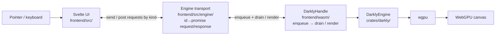

# Contributing to Darkly

Darkly is a web-based, gpu-native paint program written in Rust, Svelte and Typescript, leveraging WebAssembly and WebGPU.

This document exists to keep Darkly **minimal, elegant, and proper**. It's addressed to both humans and their agents, because the standards are the same for both. The best code is the code never written; pretty much all the principles below are in support of that core principle. `AGENTS.md` and `CLAUDE.md` are symlinks to this file.

Thanks for wanting to contribute.

## Getting Started

```bash
# Rust core + tests
cargo check --workspace
cargo test --workspace --exclude darkly-wasm --features darkly/testing -- --test-threads=1

# WASM bridge
(cd frontend/wasm && wasm-pack build --release --target web --out-dir pkg)

# Frontend dev server
(cd frontend && npm install && npm run dev)
```

Before opening a PR, run the full suite under [Lint / CI Checks](#lint--ci-checks) and read the [Testing Principle](#testing-principle).

## Architecture

Darkly's Rust core (`crates/darkly/`) is platform-agnostic: document, brush engine, GPU compositor, undo, and `DarklyEngine` itself, all with zero platform dependencies. A WASM bridge (`frontend/wasm/`) wraps the engine for the browser. The frontend's `Engine` transport (`frontend/src/engine/`) issues typed requests by kind (`send`/`post`) over a single id→promise FIFO; the wasm `DarklyHandle` enqueues them (borrowing nothing) and resolves them on a scheduled drain or at frame time. Payloads cross the boundary as `serde_wasm_bindgen` values (with raw `bytes` alongside for binary responses). A process-level `DarklySession` owns one wgpu device and hands out one `DarklyHandle` per canvas (`createHandle`); the multi-tab editor runs N handles on the one shared device.

State splits three ways: the **document** is authoritative, the **session** is transient editor state on `DarklyEngine`, and the **compositor** is a derived GPU realization. Data flows downhill, never up. The [Document Authority Principle](#document-authority-principle) is the full statement: what belongs in each, where it lives, and how to place a new piece of state.

**Runtime stack**: pointer event to pixel:



**Repo layout**: `★` marks modular subsystems (drop a new file with `pub fn register()`; `build.rs` discovers it, no central registration to touch):

```
crates/darkly/src/
  document/             Authoritative model (layer tree, canvas, ...)
    layer_kinds/  ★     group, raster, vector, void, filter
    filters/      ★     mask, selection
  actions/        ★     every command the editor can run, as data
                        (file, edit, layers, tools, view, …)
  engine/               DarklyEngine: session + per-domain dispatch
                          (painting, rendering, load/save, export,
                           floating, flatten, merge, undo_dispatch, …)
  gpu/                  Compositor, ping-pong blend, regions, readback
    blend_modes/  ★     normal, multiply, hue, color_burn, …
    effects/      ★     image effects (rainy_glass, VHS, painting, …)
    voids/        ★     procedural fill sources (camera, noise, …)
  brush/                Stroke engine + node-graph brush engine, GPU
                        compute pipelines, WGSL compilation, brush
                        bundles + import. Files: stroke_engine, eval,
                        pipeline, composite_pipeline, gpu_context,
                        wgsl_compile, bundle, library, save_points,
                        preview_renderer, checkpoint_ring, …
    nodes/        ★     graph nodes: input, math, color, shape,
                        modulation, output terminals
    stabilizers/  ★     stroke stabilizers (laplacian, …)
    import/             brush-bundle importers (krita)
  config/
    sections/     ★     schema sections (canvas, input, ui, …)
  transform/            Affine math shared by tools and the compositor
  text/                 Text layout and shaping
  tools/          ★     brush, fill, gradient, colorpicker,
                        select (rect/ellipse/lasso/polygon/magic_wand), transform
  undo/                 Per-domain undoable ops (layer, modifier, property,
                        selection, gpu_region, compound)
  format/               Save/load: zip container, manifest, registry I/O
  nodegraph/            Generic node-graph (graph, compiler, layout)
  docs_md/              Generated regions in this repo's text files
    fragments/    ★     what a region can be filled with (catalog_table,
                          catalog_graphic, app_description, …)
  product.rs            Loads product.yaml and projects it for packaging
crates/darkly/product.yaml
                        Darkly's summary, description,
                        categories, keywords. The one home for all four.
crates/darkly/presets/  Bundled config overlays (gimp, krita, photoshop)
frontend/wasm/          WASM bridge (wasm-bindgen): single API surface
frontend/src/           Svelte UI
  graphics/       ★     README graphics, rendered to PNG/JPEG headlessly
desktop/                Electron host: main, preload, storage bridge, forge
packaging/              Desktop-integration resources shared by every
                        channel (desktop entry, AppStream metainfo, icons)
```

### Read Before You Touch

Each of these is required reading *before* you change the area it covers, and safe to skip otherwise.

| If you are touching | Read first | Why |
| --- | --- | --- |
| Anything with x/y coordinates | [`docs/coordinate-systems.md`](docs/coordinate-systems.md) | A pixel moves through several frames (screen → plane → window-local → layer-local). A value carried into the wrong one is the single most recurring class of bug here, invisible until the canvas is cropped |
| The brush hover preview or on-canvas overlays | [`docs/brush-preview-and-overlays.md`](docs/brush-preview-and-overlays.md) | Brushes compile to two shader variants, `setOverlay` is single-slot, and preview swaps stroke-only bindings for fallbacks: the model that makes hover-feedback bugs visible |
| Hotkeys, the config schema, or editor presets | [`crates/darkly/presets/defaults.yaml`](crates/darkly/presets/defaults.yaml) header | Settings resolve `user → overlay (krita/ps/gimp) → defaults`, and where a key belongs follows from that. Host-editor reference hotkeys are in [`docs/*-default-hotkeys.md`](docs/) |
| A registration a README table or graphic names | [`docs/generated-markdown.md`](docs/generated-markdown.md) | Those spans are generated from the registries; see [Generated Markdown](#generated-markdown) |
| The JS/Rust boundary or the async model | [`docs/architecture-history.md`](docs/architecture-history.md) | Most "obvious simplifications" there have already been tried and reverted |
| The brush engine or its node graph | [`docs/brush/README.md`](docs/brush/README.md) | Stroke engine, node system, stabilization, and the imported brush formats |
| Making a release, the version string, or anything a `v*` tag triggers | [`docs/versioning.md`](docs/versioning.md) | "Cutting a release" there is the whole procedure, every step from choosing the version to a published release, including the release PR, whose body is the tag body rather than the two-part form. The annotated tag is the release record; the metainfo's release history is generated from the tags and committed after each release. The version itself is derived from git tags at build time and baked twice (Rust and Vite) as declared canonical twins; the `Cargo.toml` / `package.json` values are vestigial |

## DRY Principle

Don't Repeat Yourself, and interpret this broadly. If two pieces of code aren't identical but follow a similar enough pattern that they could be generalized, they should be. This applies across modules, layers (Rust, WASM bridge, JS), and systems.

**Search before writing.** To ensure what you're about to write doesn't have siblings somewhere else in the codebase, grep for similar functionality. By doing this, you may discover overlap that can be extracted into a shared component (DRYify opportunity), or even better, that what you need is already written, and can simply be imported.

**Place functionality where it generalizes.** Before writing logic, ask: "where does this belong so that it works for all cases, not just this one?" If a behavior applies to any tool, it belongs in the tool system's generic hooks, not inside one specific tool. If a behavior applies to any async operation, it belongs in the async completion pipeline, not special-cased at one call site. Putting the right logic in the right architectural layer eliminates the need to repeat it, and prevents future features from having to rediscover where to plug in. A good signal you've placed something wrong: it only works for one workflow, or a second caller would have to copy-paste the same pattern.

**Stop-sign phrases.** If you find yourself writing "mirrors X", "bit-exact copy of X", "keep in sync with X", or "identical to X" in a comment, you are duplicating code. Pause and consider why you're doing it. If it's not easily factorable into a shared feature, stop executing and raise the issue to the user.

## Modularity Principle

**Default to modular.** When you design anything with more than one variant (or that will plausibly grow one), the first question is "what's the unit, and how does the rest of the code stay ignorant of which one it's looking at?" That mindset applies at every scale: from a small enum where one method per variant beats a `match` at the call site, up to full subsystems with traits, registries, and per-variant files. The cost of designing modularly up front is almost always small; the cost of retrofitting after centralized branching has spread across the codebase is large. Hand-written dispatch should feel like an exception that needs justifying, not the default shape.

This is a stronger claim than the Engineering Principle's "build a proper system for it": that one says *don't hack*; this one says *the proper system is almost always one where new variants slot in without consumers being edited*.

Module-specific code lives in the module. Module-generic infrastructure (registries, dispatchers, shared state, caches) is generic by name and by shape, never named after any single module that happens to use it today.

When adding a new item to a modular system (filter, tool, brush, etc.):

- **DO:** Create a single file in the appropriate directory that contains everything about that module: struct, implementation, registration function, constants, helpers.
- **DO NOT:** Add match arms to a central dispatcher. Add entries to a handwritten list. Touch any file outside the module directory except the generated `mod.rs`.

Mechanics: `build.rs` scans module directories and generates each `mod.rs` (never edit by hand) with a `registrations()` function. Each variant file exports `pub fn register() -> XRegistration`; the registry calls `registrations()` to populate itself. Generic infrastructure (`Trait`, `Registration`, `Registry`) is named after the kind, not after the first variant that happened to exist. See `gpu/effect.rs` + `gpu/effects/*.rs` for a worked example.

The "default to modular" stance leads directly to the type-owned dispatch rule below: once a system is modular, the consumer must not re-introduce centralized branching by asking variants what they are.

**Type-owned dispatch:** Anything a type knows about itself (behavior, properties, capabilities, identity) lives on the type, behind a uniform interface. Consumers call methods; they never introspect, classify, or branch on which variant they got. The diagnostic question: *would adding a new variant, or changing what an existing one knows about itself, force me to edit this code?* If yes, the knowledge is misplaced. The violation has one recurring shape: `matches!(type_id, ...)`, `if kind == X`, `fn is_foo(type_id) -> bool`, or any consumer-side helper that routes by type, code outside a type's own module asking questions the type should be answering itself. Replace it with a trait method, defaulted to the common case and overridden per variant, so new variants are purely additive.

## Ownership Principle

State belongs to the thing it describes, not to a parent that manages it on its behalf. Don't let Rust's borrow checker dictate the data model. If splitting state out of a struct makes borrowing easier but scatters a logical concept across multiple locations, find a different way to satisfy the borrow checker (helper methods, borrow-splitting, restructured access) and keep the data model clean.

## Document Authority Principle

The **document** is the authoritative model. The **compositor** is a derived realization. State falls into three categories:

- **Document** (`crates/darkly/src/document/`, `src/layer.rs`): persistent, undoable, serializable. Tree structure, layer properties, mask presence, layer extents, selection regions, canvas size + `canvas_origin` (see [`docs/coordinate-systems.md`](docs/coordinate-systems.md): the canvas window is a plane rect anchored at `canvas_origin`). Must be possible to reason about without a GPU.
- **Session** (fields on `DarklyEngine` and tool/UI structs): transient editor state. Active tool, mask-editing target, viewport transform, in-flight stroke, undo stack. Does not survive reload.
- **Compositor** (`src/gpu/compositor.rs` and friends): GPU textures, bind groups, pipelines, render caches. Always derivable from document + dirty regions; rebuildable on demand.

**Data flows downhill: document → compositor, session → compositor.** The compositor never feeds back upward. If a piece of state seems to want to flow up, the model is broken: fix the originating operation to lead with the document.

**Bulk pixel data (layer pixels, mask pixels) is the principled exception**: GPU-authoritative because it's huge and the GPU is where it's used. The document tracks "this layer has pixels" structurally (e.g. `has_mask`); the bytes themselves live in VRAM.

**Anti-patterns to recognize and refuse:**

- A doc-side bool and a `HashMap<LayerId, _>` on the compositor that mirror the same fact (`has_mask` vs `mask_textures.contains_key(id)` was the canonical example).
- A doc-side field and a GPU resource's metadata that must be manually re-synced after a compositor-led operation.
- The same logical fact stored in two places "for ergonomics"; pick one home and expose a getter for the other side.

**When in doubt:** if the value survives save/load, it's document. If it can be rebuilt from the document on the next frame, it's compositor. Otherwise it's session.

## Prior Art Principle

When the design space is genuinely open, research how established editors handle it, and skip it for additive changes, existing patterns plumbed somewhere new, or anything in-repo precedent already answers. Krita and GIMP are checked out under the project root (`krita/`, `gimp/`). Read the actual source; never rely on web searches, docs, blog posts, or LLM training data for architectural claims. If a reference repo isn't checked out, clone it. Never claim "Krita does X" without pointing to a specific file and function. When delegating research to a subagent, instruct it to clone and cite specific files and line numbers; reject any claim not backed by source.

We do not blindly copy prior art; we use it to inform our own decisions. Our implementation will differ in specifics (GPU pipelines, tile formats, Rust idioms), but core algorithms and architectural decisions should be informed by prior art, not invented from scratch.

## Credit Principle

When an idea, algorithm, shader, or implementation comes from an external source (open source code, Shadertoy, papers, blog posts, video tutorials, etc.), credit the source and author at the top of the file (or inline next to the borrowed fragment, if it's smaller than file-scope). Include the author's name or handle and a link to the original.

## Planning and Independent Review Workflow

Every bug fix and feature follows these five steps unless the user waives them, and no production code changes before step 5. Steps 1 and 2 each need a fresh, isolated agent given only the repository instructions and its own task; if isolated agents are unavailable, ask the user to run that step in a fresh session.

1. **Draft.** The planning agent investigates the code and any prior art it needs, then writes a self-contained plan to `docs/plans/<name>.md`: root cause or feature semantics, architectural impact, implementation steps, tests, risks, open questions, and a LOC estimate (lines added or removed, split into production, tests, and generated/docs). The estimate is a primary scope and complexity signal, not optional metadata. For bugs, include a regression test that will fail before the fix.
2. **Review.** A different agent investigates independently and challenges the plan: diagnosis, scope, architecture, ownership, authority, modularity, duplication, complexity, prior-art support, test coverage. It hunts for the simplest general solution, including deleting machinery or moving behavior to its proper owner, and checks that bug tests reproduce the reported failure. Concrete, file-referenced findings go under `## Independent Review` at the top of the plan, with a verdict: `accept`, `revise`, or `rethink`.
3. **Revise.** The orchestrator addresses every substantive finding in the plan or records an evidence-backed reason for rejecting it, preserving the review. `rethink` means re-investigate and rewrite the approach, not patch it.
4. **Approve.** Give the user the LOC estimate first, since it is the clearest signal of implementation size and possible over-design, then the plan path, verdict, approach, tradeoffs, and open questions, and confirm implementation has not begun. Stop and wait for explicit approval. Material plan changes go back through review and approval.
5. **Implement.** The orchestrator implements and verifies the plan, demonstrating each bug's regression test failing first. Keep the plan synchronized with material discoveries. If the expected LOC materially exceeds the approved estimate, or the design has to change materially, stop and explain before continuing.

## Testing Principle

**Every feature must have a test.** Verify the feature works. The test exists; it passes. That's it.

**Every bug must have a _regression_ test: one that defends against that specific bug being reintroduced.** "Regression" means "the bug we just fixed must not come back"; a test for a new feature is not a regression test, even if it follows the same pattern. Write it FIRST, confirm it FAILS against the unfixed code, then fix the bug and confirm it passes; if it doesn't fail without the fix, it doesn't count.

## No Blocking GPU Readbacks

**Never use `device.poll(Wait)`, `blocking_read()`, `readback_texture()`, or any synchronous GPU to CPU readback in production code.** These deadlock on WebGPU/WASM: the browser event loop is the only mechanism for resolving GPU buffer mappings, and any form of blocking prevents it from running. Readback is async: `request_readback()` → `readbacks.submit()` → poll on the next frame via `ReadbackScheduler`.

The full stack trace of the deadlock, the CPU-cache variant for textures that change infrequently, and the test-only escape hatch are in [`docs/lessons-learned/gpu-lessons-learned.md`](docs/lessons-learned/gpu-lessons-learned.md) §5.

## Engineering Principle

Every system must be implemented properly. No hacks, no hardcoding, no shortcuts in Rust or the WASM bridge. If we implement one of something, we build a proper system for it. It's okay to take a step back from the current task to do things right.

**Every bug is a signal that something nearby is awkward or overcomplicated.** Before patching, ask: "is this an elegant solution?" If the answer is no, the bug is telling you the code wants to be restructured: propose a refactor instead of layering a fix on top. The cleanest fix is often the one that makes the bug impossible to express, not the one that handles it.

**Comments describe the code, not the plan that produced it.** Write comments about what the code does and why it's there as it stands, never about the process that got it there. Do not reference ephemeral planning artifacts: step or phase numbers, plan-list items, "TODO from the plan", "as decided in step 3", or before/after framing ("new", "now", "previously", "used to") that only makes sense relative to a change in flight. A comment that would be meaningless to someone reading the file fresh (with no knowledge of the task that introduced it) is in the wrong register; rewrite it to stand on its own, or delete it.

If you're implementing one of the unchecked features in the README roadmap, or one that definitely deserves to be there, keep the roadmap up to date.

## No Migrations / No Backwards Compatibility (pre-release)

Darkly is in pre-release / alpha. Until the first public release, breaking on-disk and on-the-wire formats is fine: do not write migrations, format-version upgrade paths, or legacy compatibility shims. Make the breaking change directly and update every producer and consumer in the same pass; existing artist data can be invalidated.

## No En or Em Dashes

Darkly's prose uses plain hyphens. **No en dashes and no em dashes anywhere in a tracked file**: code, comments, docs, markdown, commit messages, PR bodies. Use a hyphen, comma, colon, or parentheses instead. `./scripts/check-dashes.sh` fails on either character and runs with the rest of the suite.

## PR Descriptions

Fork every feature branch off `dev` and target PRs at `dev`, never `master` (which only receives release merges from `dev`, despite being GitHub's default branch).

Every PR body has **two parts**: a human-written preamble explaining *why* the work was undertaken and who it's useful to, then the AI-generated technical description below a `---` separator. When you finish implementing a plan, emit the PR description in a fenced markdown code block as part of your reply, shaped like this, leaving the top as a placeholder for the human to fill in:

````markdown
<insert human description here>

---

<AI PR description>
````

The AI portion must cover the *entire* feature branch (everything since it diverged from `dev`), not just the latest change: the user pastes the whole block as the PR body. On follow-up work, re-emit the complete, updated block as a single description that wholly replaces the previous one; never emit a delta or a partial revision.

## Generated Markdown

Parts of this repository's markdown are generated from the registries: a span bracketed by `<!-- darkly:… -->` comments is filled from the `&'static str` on the registration that owns it. **Never edit inside a region**, the next sync overwrites it; fix the registration instead. `cargo sync-docs` refills every region, and `tests/docs_md.rs` fails on a stale one, so the ordinary test suite is the gate.

Regions, preview stills, and catalog graphics (the parts that need a GPU or a browser-free rasterizer, and so are not automatic) are covered in [`docs/generated-markdown.md`](docs/generated-markdown.md).

## Lint / CI Checks

Run at commit time only, not during iterative debugging. Use `cargo check` for mid-iteration build sanity. All must pass:

```bash
./scripts/check-dashes.sh   # no en or em dashes in any tracked file
cargo fmt --all -- --check
RUSTFLAGS="-D warnings" cargo clippy --workspace --all-targets --exclude darkly-wasm --features darkly/testing -- -D warnings
RUSTFLAGS="-D warnings" cargo clippy -p darkly-wasm --target wasm32-unknown-unknown --all-targets -- -D warnings
# `--test-threads=1` is mandatory: GPU-touching integration tests share a
# process-wide wgpu device and SIGSEGV when run in parallel.
cargo test --workspace --exclude darkly-wasm --features darkly/testing -- --test-threads=1
# `protocol_gen.ts` is generated from the request registry, and the test that
# asserts it matches what is checked in sits behind `ts-export`, which the run
# above does not enable. Without this line nothing checks it.
cargo test -p darkly --test protocol --features testing,ts-export -- --test-threads=1
(cd frontend/wasm && wasm-pack build --release --target web --out-dir pkg)
# Both TS gates are required: `tsc` cannot see inside `.svelte` files, so it
# gives a false green on component bugs that `svelte-check` catches.
(cd frontend && npx tsc --noEmit)
(cd frontend && npm run check)
(cd frontend && npm run build)
(cd frontend && npm test)
(cd desktop && npm ci && npx tsc --noEmit && npm test)
```

Every flag above is load-bearing. What each one defends against, the shape Vitest tests have to take with no DOM, and the `cargo sweep` housekeeping that keeps `target/` from ballooning are in [`docs/checks.md`](docs/checks.md).

Never run `git commit`: make the changes and leave staging and committing to the user.

## Questions

Open an issue, or contact <info@darkly.art>.
