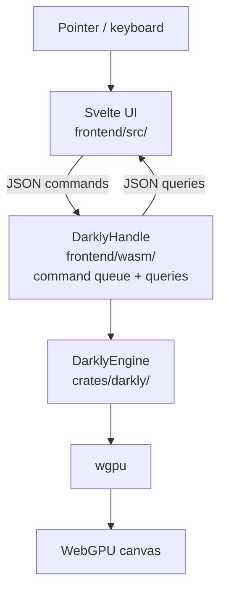
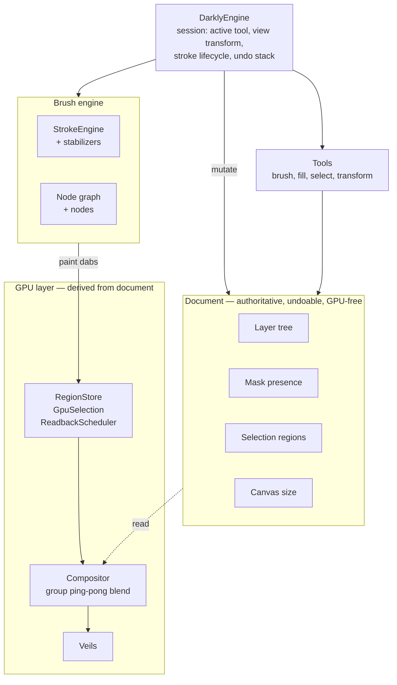

# DARKLY

Darkly is a digital paint program for artists. Its purpose is to empower veteran and new artists alike by accomodating their existing workflows, and introducing new elements designed to help them compete with AI.

Darkly's characteristic feature is "veils" - a way of mutating or obfuscating the canvas to stimulate creative exploration. 

Similar to how an AI leverages entropy to iteratively derive an image from noise, Darkly introduces entropy onto the canvas in a variety of clever and satisfying ways -- heat waves, rainy glass, turbulent water, retro CRT. These veil effects help to counteract inherent human tendencies which have always plagued artists:

- artist's block (the dreaded "white canvas")
- premature fixation on detail (RIP composition)
- lack of confidence / fear of exploration
- artist blindness (losing fresh eyes after staring at a work for too long)

Basically, Darkly gives you permission to explore wildly and freely, brainstorming with entropy, trying out different compositions, and unlocking secrets latent in your own imagination. 

It frees you from rulers, sharp lines, and your own inner critic, enabling you to paint freely and without judgement, behind the veil.

The result is a speedier and more creative ideation process, which unearths artistic expressions unique to you. What will *YOU* see in the entropy? It may surprise you!

## Architecture

Darkly's Rust core (`crates/darkly/`) is platform-agnostic. It contains the document model, GPU compositor, veils, brush engine, undo system, and the `DarklyEngine` — all with zero platform dependencies. A WASM bridge wraps the engine for the browser.

State is split three ways: the **document** is authoritative and undoable (layer tree, masks, selection, canvas size); **session** state lives on `DarklyEngine` (active tool, view transform, in-flight stroke); the **compositor** is a derived realization (GPU textures, blend pipelines, render caches) that's always rebuildable from the document. Data flows downhill — document → compositor, session → compositor — never the other way.

**Runtime stack** — how a pointer event becomes a pixel:



**Inside the Rust core** — the document is authoritative; the compositor is a derived realization. Data flows downhill, never up:



**Modular subsystems** — `build.rs` scans these directories and auto-generates the registration code, so adding a veil / tool / brush node / stabilizer / config section is a single new file with a `register()` function. No central match arms, no hand-maintained lists.

| Directory | What lives here |
| --- | --- |
| `gpu/veils/` | Veil effects (rainy glass, VHS, kuwahara, …) |
| `tools/` | Selection + transform tools |
| `brush/nodes/` | Brush graph nodes (pen_input, stamp, curve, …) |
| `brush/stabilizers/` | Stroke stabilizers |
| `config/sections/`, `config/presets/` | Config schema sections + bundled presets |

```
crates/darkly/          Platform-agnostic core (wgpu, pure Rust)
  src/document.rs       Authoritative document model
  src/engine/           DarklyEngine — session state + dispatch
  src/gpu/              Compositor, veils, shaders
  src/brush/            Node-graph brush engine, stroke engine, library
  src/nodegraph/        Generic node-graph (graph, compiler, layout)
  src/tools/            Selection / transform tools
  src/undo/             Undo stack + per-domain undoable ops
frontend/wasm/          WASM bridge (wasm-bindgen) → browser
frontend/src/           Svelte UI
shared/styles/          @darkly/styles — tokens + themes shared by UI and website
website/                Astro + Starlight site (splash, docs, /demo/)
```

## Getting started

### Prerequisites

- [Rust](https://rustup.rs/) (stable)
- [wasm-pack](https://rustwasm.github.io/wasm-pack/installer/)
- [Node.js](https://nodejs.org/) >= 18

```sh
# Install all workspace dependencies (frontend + website + shared styles)
npm install

# Build the WASM package
wasm-pack build frontend/wasm --target web

# Start the frontend dev server
npm --prefix frontend run dev
```

Open the URL printed by vite (typically `https://localhost:5173`). Requires a browser with WebGPU support (Chrome 113+, Edge 113+, Firefox Nightly with flag).

**GPU backend configuration (Linux):** Chrome's WebGPU defaults to a software rasterizer on many Linux setups. Launch Chromium with GPU and Vulkan support:

```sh
chromium --enable-features=Vulkan --enable-unsafe-webgpu
```

You can verify the active backend at `chrome://gpu` — look for "Vulkan" under Graphics Feature Status. On macOS and Windows this is generally not needed (Metal and D3D12 are used by default).

## Website & docs

The `website/` workspace contains the splash page and markdown docs (Astro + Starlight). It shares design tokens with the frontend via the `@darkly/styles` workspace package, so one edit in `shared/styles/` propagates to both surfaces.

```sh
# Dev server with hot reload (http://localhost:4321)
npm --prefix website run dev

# Production build — also builds the frontend and mounts it at /demo/
npm --prefix website run build

# Preview the built site locally
npm --prefix website run preview

# Site-only build (skip the frontend WASM rebuild)
npm --prefix website run build:site-only
```

Routes:

- `/` — splash page (`website/src/pages/index.astro`)
- `/guides/*` — docs (`website/src/content/docs/guides/`)
- `/demo/` — the live WebGPU app, populated by `npm run build`

Adding a doc page: drop a `.md` file under `website/src/content/docs/guides/` — it's auto-picked up by the sidebar.

## Adding veils

Darkly uses auto-discovery: drop a `.rs` file in `crates/darkly/src/gpu/veils/` and export a `pub fn register()`. The build script generates `mod.rs` automatically. No other files need to be touched.

See `veils/pixelate.rs` for the pattern. The same auto-discovery pattern applies to `tools/`, `brush/nodes/`, `brush/stabilizers/`, `config/sections/`, and `config/presets/` — see [crates/darkly/build.rs](crates/darkly/build.rs).

## Acknowledgments

Darkly stands on the shoulders of giants. Two programs in particular have influenced this project, and we love them dearly.

**[GIMP](https://www.gimp.org/)** ([source](https://github.com/GNOME/gimp)) — originally written by **Spencer Kimball** and **Peter Mattis** in 1995, and maintained today by **Michael Natterer** and **Jehan Pagès**, with decades of contributions from a community far too large to list here (see the upstream [`AUTHORS`](https://github.com/GNOME/gimp/blob/master/AUTHORS) file).

**[Krita](https://krita.org/)** ([source](https://github.com/KDE/krita)) — led by **Halla Rempt** (formerly Boudewijn Rempt), with core contributions over the years from **Dmitry Kazakov**, **Cyrille Berger**, **Sven Langkamp**, **Wolthera van Hövell tot Westerflier**, **L. E. Segovia**, **Scott Petrovic**, and many more (see the upstream [`developers.txt`](https://github.com/KDE/krita/blob/master/krita/data/aboutdata/developers.txt)).

### Veils

Several of Darkly's veil shaders are ports or adaptations of work originally published on [Shadertoy](https://www.shadertoy.com/). The originals are exquisite; please go see them in their native habitat!

- **Bokeh** — based on [ldG3W3](https://www.shadertoy.com/view/ldG3W3) by [Dave Hoskins](https://www.shadertoy.com/user/Dave_Hoskins).
- **Kuwahara** — based on [mlffWf](https://www.shadertoy.com/view/mlffWf) by [p4vv37](https://www.shadertoy.com/user/p4vv37), with technique notes from [Acerola / Garrett Gunnell](https://github.com/GarrettGunnell/Post-Processing/tree/main/Assets/Kuwahara%20Filter).
- **Rainy glass** — ported from "Heartfelt" ([ltffzl](https://www.shadertoy.com/view/ltffzl)) by [Martijn Steinrucken / BigWIngs](https://www.shadertoy.com/user/BigWIngs). Licensed CC BY-NC-SA 3.0.
- **VHS** — ported from [XtBXDt](https://www.shadertoy.com/view/XtBXDt) by [FMS_Cat](https://www.shadertoy.com/user/FMS_Cat).
- **Watercolor** — based on [mdlXW2](https://www.shadertoy.com/view/mdlXW2) by [aeva](https://www.shadertoy.com/user/aeva).
